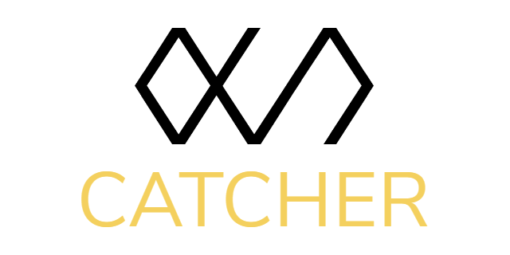

<h1 align="center">
  
   
  
Catcher

</h1>

    
    
    
    

A simple, minimized error collector.

## Features
- Register new service to collect error catches  
- Collect error logs by calling API  
- Show reviews in [official web](https://catcher.devx.kr)  
- Android, CSharp library provided!  

## Android Library
[ANDROID PROJECT](https://github.com/LIMECAKE/Catcher/tree/master/Android)  
[ANDROID LIBRARY DOWNLOAD](https://github.com/LIMECAKE/Catcher/releases)  

## CSharp Library
[CSharp PROJECT](https://github.com/LIMECAKE/Catcher/tree/master/CSHARP)  
[CSharp LIBRARY DOWNLOAD](https://github.com/LIMECAKE/Catcher/releases)  

## How to Use
- Create new service in [official website](https://catcher.devx.kr)  
- Use [Library](https://github.com/LIMECAKE/Catcher/releases) to easily collect user review  
- Then, you can see collected error logs in [offical website](https://catcher.devx.kr)  

## Screenshots

</img>
</img>

## License
[MIT](LICENSE) © 2020 LimeCake <limecake23@gmail.com>